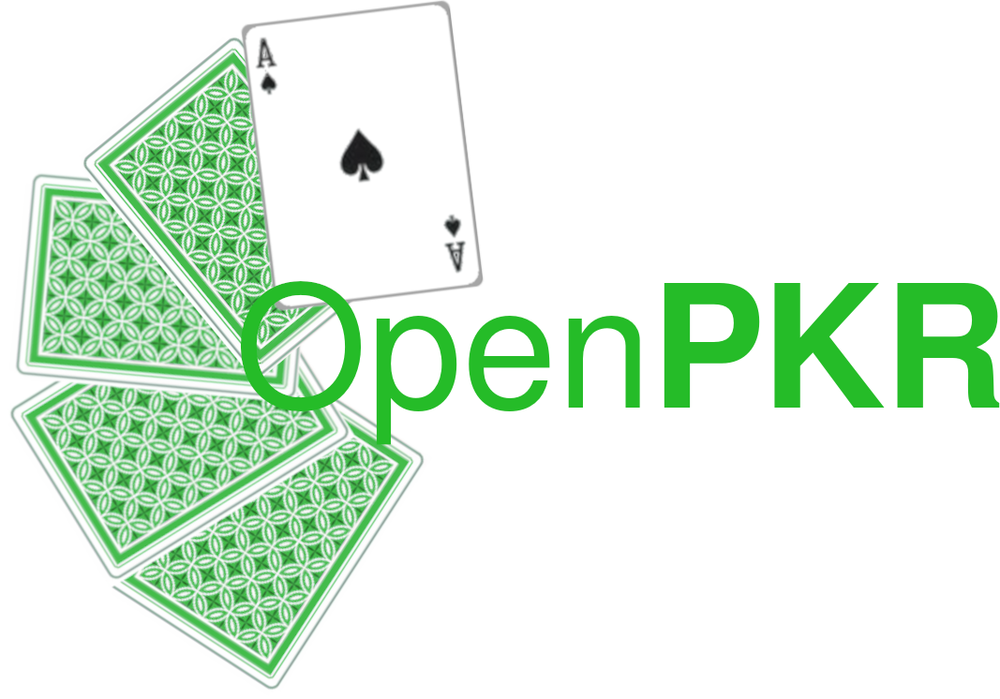

# OpenPKR



Card games written in C for use in other projects.  Please enjoy!

List of games currently (or planned to be) implemented in OpenPKR:
- Texas Hold'em
- Blackjack (planned)
- More in the future!

## Build
For direct CMake usage:
```
$ mkdir build && cd build
$ cmake -B . -S ..
$ cmake --build .
```

Or, more simply,
```
$ chmod +x build.sh
$ ./build.sh
```

## Usage
For simple usage of OpenPKR, please refer to test/test.c as an example, which shows how to start a Poker game with a custom set of decision policies.
